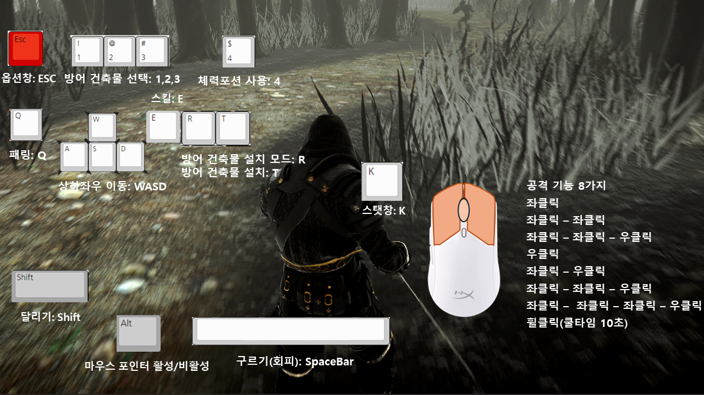

<div align="center">
  
</div>

<details><summary><h2>README 구성</h2>
</summary>
  
- [프로젝트 소개](#프로젝트-소개)
- [주요 기능](#주요-기능)
- [게임 소개 영상](#게임-트레일러-영상)
- [조작법](#조작법)
- [기대 효과](#기대-효과)
- [사용된 기술](#사용된-기술)
- [설치 및 실행 방법](#설치-및-실행-방법)
- [라이센스](#라이센스)
- [팀원 소개](#팀원-소개)

</details>


  
## 프로젝트 소개
2023년 조사에 따르면 전체 게임 이용자 중 61%가 PC 게임을 이용하며, 이 중 82.8%가 Steam 같은 온라인 플랫폼을 통해 게임을 구매하고 있습니다. 이용자들의 주중 평균 게임 이용 시간은 약 100분으로, 짧고 반복적인 경험을 통한 만족을 선호하는 것으로 나타났습니다. 이에 따라, RPG, 고난이도 전투, 전략 시뮬레이션 장르를 결합하고 핵 앤 슬래시 요소가 포함된 독특한 디펜스 전투를 추가한 새로운 형태의 PC 게임을 제안합니다. "Under World"는 다양한 환경에서 진행되며, 플레이 타임은 약 20분으로 설계되어 이용자들이 짧은 시간에 반복적인 플레이를 통해 재미를 느낄 수 있도록 제작되었습니다.


## 주요 기능
- **다양한 던전 환경**: 각기 다른 분위기의 던전을 경험할 수 있습니다.
- **몬스터와 방어물 배치**: 전략적인 배치로 최적의 방어를 구축할 수 있습니다.
- **실시간 멀티플레이어**: 플레이어와의 경쟁을 통해 본인의 전투력을 증명할 수 있습니다.
- **디펜스 모드**: 포탈이 활성화된 후 몰려드는 플레이어와 몬스터를 막아야 합니다.


## 게임 소개 영상( ←트레일러 영상 / 기능 영상→ )

[](https://www.youtube.com/embed/IHzPKSxICCo)
[](https://www.youtube.com/embed/XV0ZB3LQa24)


## 조작법
<div>
  
</div>

## 기대 효과
3가지의 다른 콘셉트를 가진 가상의 게임 공간 속에서 플레이어간 경쟁 및 몬스터와의 전투를 통하여 전략을 시험해볼 수 있는 기회를 제공합니다. 탈출이라는 하나의 목표를 제시하여 탐험과 도전의식을 불러일으키고 층마다 다른 환경을 제공함으로써 플레이어가 다채로운 게임 경험을 느낄 수 있도록 하고 이에따라 다양한 플레이 방식을 선택할 수 있도록 합니다.

## 사용된 기술
<div aling="center">
  
</div>

- **Unity**: 게임 개발을 위해 사용한 엔진
- **C#**: 게임 로직 구현에 사용한 프로그래밍 언어
- **Photon**: 멀티플레이어 기능 구현에 사용한 네트워크 라이브러리

## 설치 및 실행 방법
1. 이 저장소를 클론합니다.
    ```bash
    git clone https://github.com/sb-111/Capstone-Design.git
    ```
2. Unity를 사용하여 프로젝트를 엽니다.
3. `Play` 버튼을 눌러 게임을 실행합니다.

 
## 라이센스
에셋 스토어상 유료 에셋 패키지들이 있어 clone후 사용이 불가합니다. [.gitignore](https://github.com/sb-111/Capstone-Design/blob/main/.gitignore) 을 참고해주세요


## 팀원 소개
- **허승빈**: 몬스터 AI, 스탯 UI, 플레이어 성장시스템 구축
- **이영재**: 포톤 서버 구축, 맵디자인, UI 및 시네머신 영상 제작
- **황혜원**: 포톤 서버 구축, 건축물 제작, 시스템 구축
